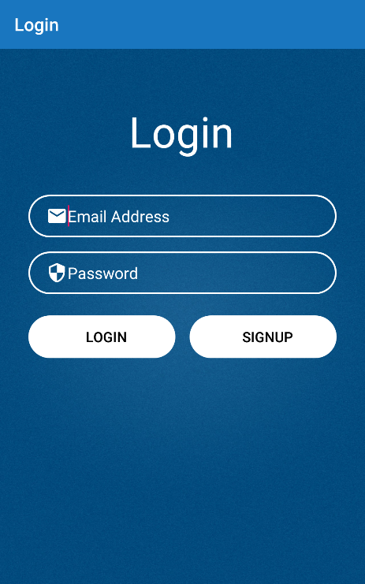
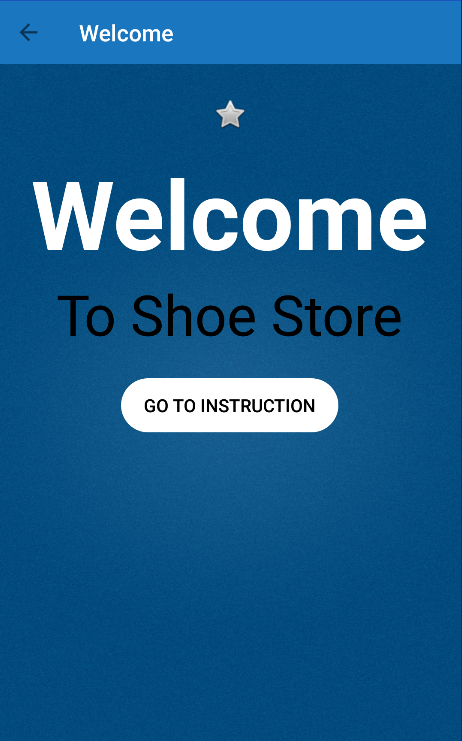
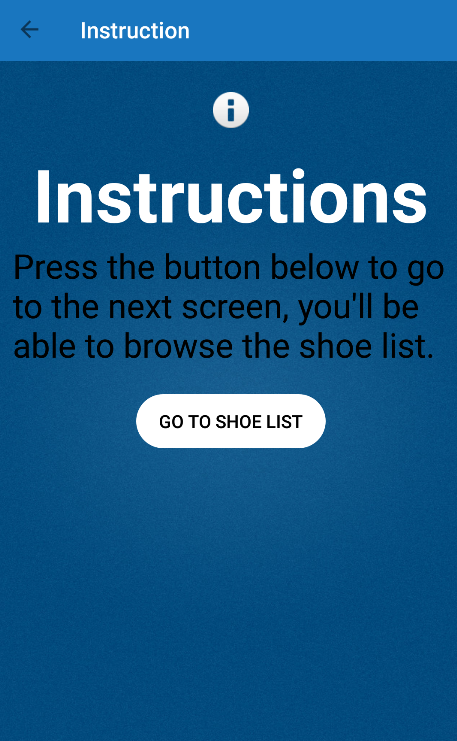
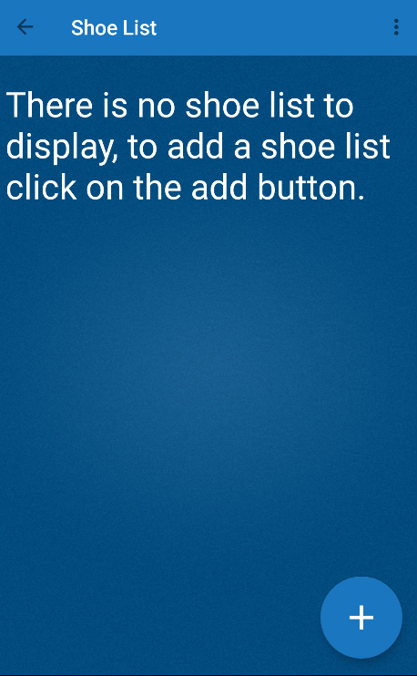
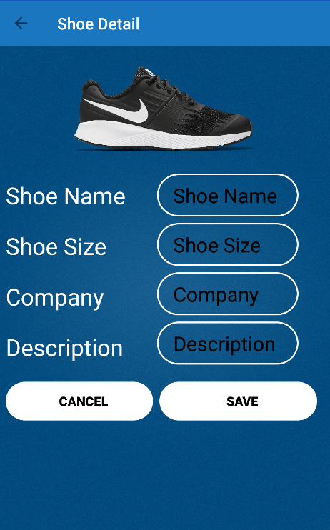
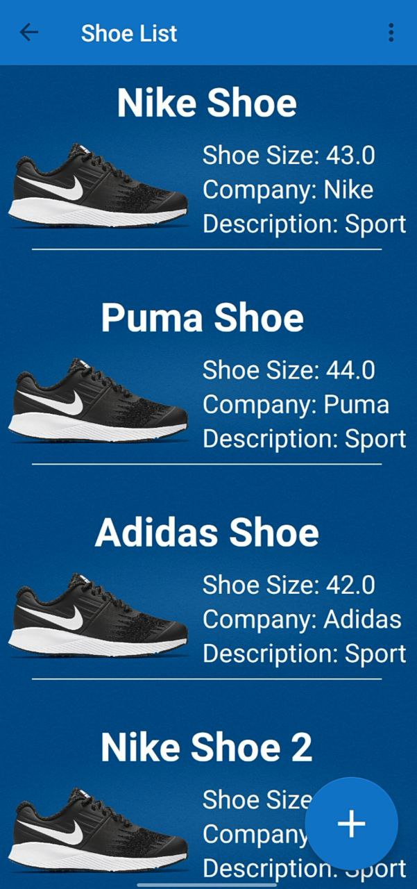
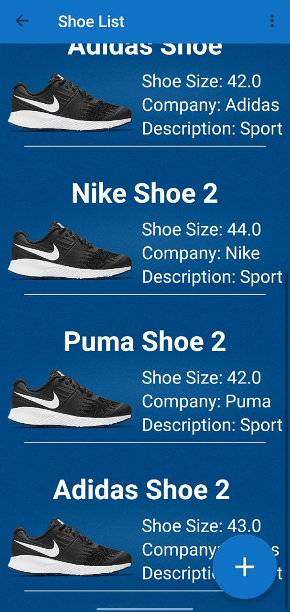
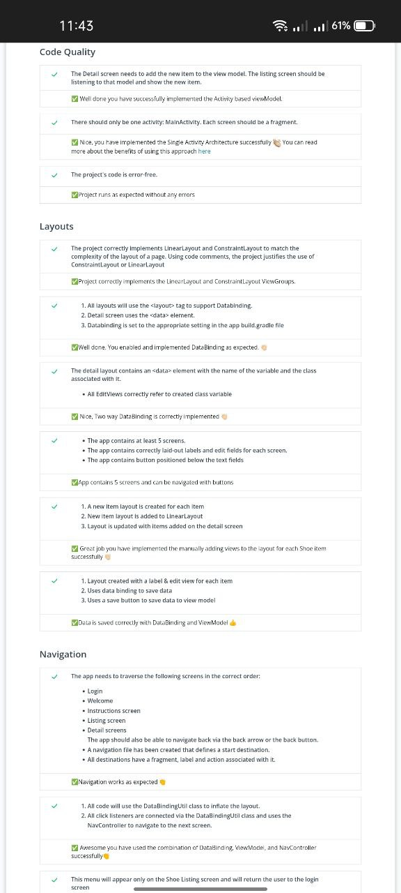

# Shoe Store

I created Shoe Store Inventory App the first project in the Advanced Android Kotlin Development Nanodegree from Udacity

## Some of the Technologies and Techniques Used
- LiveData

- ViewModel

- Data Binding

- Scroll View 

- ConstraintLayout

- Add View To Layout

- Navigation Component

## Screenshots
 
 
 
 
 
 
 

## Udacity Review

