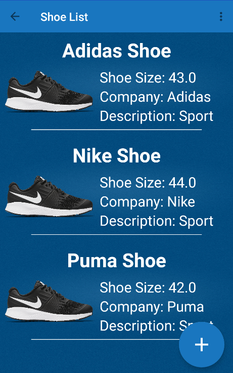

# Shoe Store

I created this application to present the first project in the Advanced Android Kotlin Development Nanodegree.

## Some of the Technologies and Techniques Used
- LiveData
- ViewModel
- Data Binding
- ConstraintLayout
- Add View To Layout
- Navigation Component

### Screenshots
 
 
 
 
 
 
